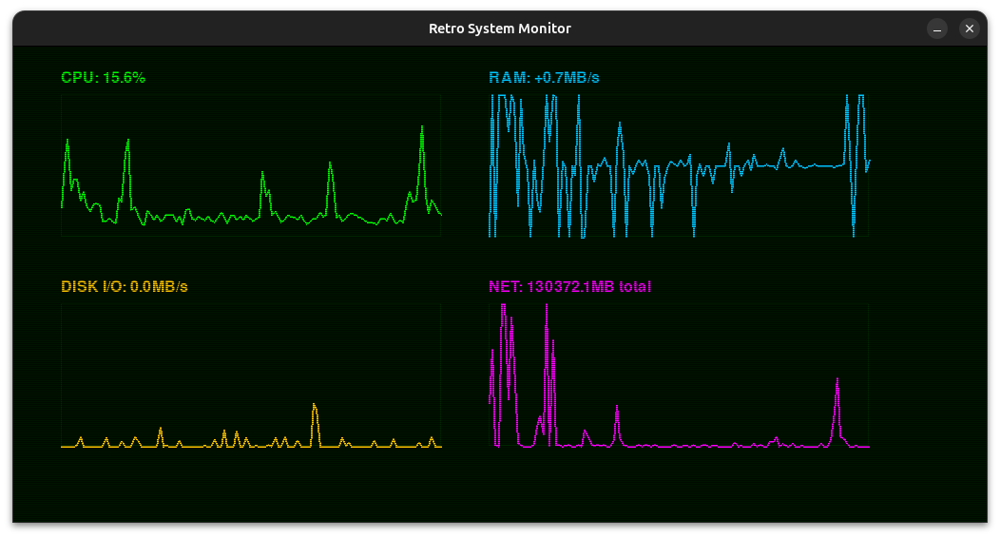

# 🖥️ Retro System Monitor

A nostalgic, VFD-inspired system monitoring dashboard built with Python and Pygame. Experience real-time system metrics with the aesthetic of vintage CRT displays and oscilloscope screens.



## ✨ Features

- **Real-time System Metrics**
  - CPU usage tracking with per-core support
  - RAM allocation/deallocation rate monitoring
  - Disk I/O activity (read/write speeds)
  - Network throughput tracking

- **Retro Visual Design**
  - Classic phosphor green CRT aesthetic
  - Authentic scanline effects
  - Oscilloscope-style line graphs
  - Multi-color coded metrics (green, cyan, amber, magenta)

- **Clean Architecture**
  - Test-Driven Development (TDD) approach
  - Object-oriented design with abstract base classes
  - Modular collector system for easy extension
  - Reusable widget framework

## 🎯 Project Goals

This project was created as a learning exercise to practice:

1. **Python Programming Skills**
   - Object-oriented design patterns
   - Abstract base classes and inheritance
   - Modular, maintainable code structure

2. **Test-Driven Development (TDD)**
   - Writing tests before implementation
   - Achieving comprehensive test coverage
   - Using pytest for unit testing

3. **Systems Programming**
   - Interfacing with OS-level metrics via `psutil`
   - Real-time data collection and processing
   - Efficient ring buffer implementation for time-series data

4. **Graphics & UI Development**
   - Pygame fundamentals
   - Custom widget rendering
   - Visual effects programming
   - Retro aesthetic design

## 🏗️ Architecture

### Data Collection Layer
- `DataCollector` - Abstract base class for all collectors
- `CPUCollector` - CPU usage metrics
- `MemoryCollector` - RAM usage and allocation rates
- `DiskCollector` - Disk usage and I/O rates
- `NetworkCollector` - Network traffic statistics

### UI Layer
- `Display` - Main window and event handling
- `Widget` - Abstract base class for UI components
- `GraphWidget` - Time-series line graph visualization
- `Theme` - Centralized styling and color schemes

### Utilities
- `RingBuffer` - Circular buffer for efficient historical data storage
- `Effects` - Visual effects (scanlines, potential for CRT glow)

## 🚀 Getting Started

### Prerequisites
```bash
Python 3.8+
```

### Installation

1. Clone the repository:
```bash
cd retro-system-monitor
```

2. Install dependencies:
```bash
pip install -r requirements.txt
```

### Running the Monitor
```bash
python main.py
```

### Running Tests
```bash
pytest
```

For verbose output:
```bash
pytest -v
```

For coverage report:
```bash
pytest --cov=. --cov-report=html
```

## 📊 What You'll See

- **Top Left (Green)**: CPU usage percentage
- **Top Right (Cyan)**: RAM allocation rate (MB/s)
- **Bottom Left (Amber)**: Disk I/O activity (MB/s)
- **Bottom Right (Magenta)**: Network throughput

Each metric displays as a scrolling oscilloscope-style graph showing the last 120 samples, with authentic CRT scanlines for that vintage computing feel.

## 🎨 Customization

### Adjusting Update Speed
In `main.py`, modify the `update_interval`:
```python
update_interval = 10  # Higher = slower updates
```

### Changing Scanline Intensity
```python
Effects.apply_scanlines(display.screen, intensity=0.5, spacing=2)
# intensity: 0.0 (invisible) to 1.0 (solid black)
# spacing: pixels between scanlines
```

### Adding New Metrics
1. Create a new collector inheriting from `DataCollector`
2. Write tests in `tests/test_your_collector.py`
3. Implement the collector
4. Add a `GraphWidget` in `main.py`

## 🧪 Testing Philosophy

This project follows strict TDD principles:
- ✅ Tests written before implementation
- ✅ Comprehensive test coverage for all collectors
- ✅ Separate test files for each component
- ✅ Mock-based testing for rendering logic

## 🛠️ Built With

- **Python 3.x** - Core language
- **Pygame** - Graphics and window management
- **psutil** - System metrics collection
- **pytest** - Testing framework

## 📝 Learning Outcomes

Through this project, I gained hands-on experience with:
- Disciplined TDD workflow (Red → Green → Refactor)
- Designing extensible OOP architectures
- Working with system-level APIs
- Creating custom visual effects
- Managing real-time data streams
- Git workflow in PyCharm

## 🎯 Future Enhancements

Potential features to explore:
- [ ] Additional visual effects (phosphor glow, CRT curvature)
- [ ] Configurable themes (amber, green, blue terminals)
- [ ] Process list widget
- [ ] Historical data export
- [ ] Customizable graph ranges
- [ ] GPU metrics (if available)
- [ ] Temperature monitoring

## 📄 License

This project is open source and available under the MIT License.

## 🙏 Acknowledgments

Inspired by vintage computing aesthetics, oscilloscope displays, and the golden age of CRT monitors.

---

**Happy Monitoring!** 🖥️✨